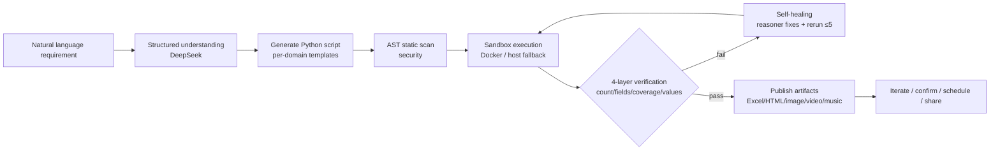
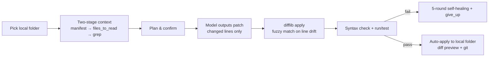

# 🤖 AI Automation Generator

> **Describe it in one sentence → AI writes the code, runs it, verifies it, and ships it.**
>
> An **LLM-as-Compiler engine**: natural language requirements are compiled into executable scripts, run in a sandbox, verified by a 4-layer checker, self-healed on failure, and published as shareable artifacts (games, reports, videos, images, music, TTS, data).

Built with **FastAPI + DeepSeek + Next.js** · Zero-code automation · Docker-ready

[Features](#-features) · [Quick Start](#-quick-start) · [Architecture](#-architecture) · [Security](#-security) · [Docs](#-docs) · [Roadmap](#-roadmap)

---

## ✨ Why this project

This is not a "prompt wrapper" — it's a real engineering effort around **LLM-as-Compiler**. Highlights:

| Highlight | Description |
|---|---|
| 🧠 **LLM-as-Compiler pipeline** | Requirement → structured understanding → Python script generation → sandbox execution → **4-layer verification** (count / fields / feature coverage / values) → self-healing |
| 🩹 **Multi-round self-healing** | On failure, full stderr is fed back to the reasoning model (deepseek-reasoner); it can swap implementations (e.g. native compile failure → pure-JS alternative), up to 5 rounds, with an explicit `give_up` escape |
| 📝 **apply_patch protocol** | The model outputs **only changed lines (diff)** instead of rewriting whole files — dramatically fewer output tokens; backend applies with difflib + fuzzy matching when line numbers drift |
| 📂 **Two-stage context** | For large projects, first show a file manifest and let the model pick what to read (`files_to_read`) + **grep** to locate call sites / definitions (measured: only 1-2 of 17 files read) |
| 🔧 **AI dev assistant** (`/claude`) | Pick a local folder → AI plans → confirm → edits → auto-applies back, with run/test/background-service support and diff preview |
| 🛡️ **Defense-in-depth security** | AST static scanning (eval/exec, command injection, SSRF, sensitive-file reads, login-state exfiltration) + Docker sandbox + zip-slip/bomb protection + same-origin XSS isolation (see [Security](#-security)) |
| 🧩 **Skill system** | Declarative `SKILL.md` skills (FFmpeg video editing, ezdxf CAD drawing…) auto-matched by keywords, zero-code extension |
| ⏰ **Automation** | Timed reminders, window/screen monitors, recurring tasks — 30s scheduler with dedup and overlap protection |
| 🎨 **Content generation suite** | HTML reports, web games, AI music/video/image, TTS, data Q&A |

---

## 🚀 Quick Start

### Requirements
Python 3.10+ · Node.js 18+ · Docker (optional, recommended)

### One-command start (Windows)

```powershell
Copy-Item .env.example .env   # fill in DEEPSEEK_API_KEY (required) and JWT_SECRET_KEY
powershell -ExecutionPolicy Bypass -File start.ps1        # backend 8000 + frontend 3000 + assets 8001
powershell -ExecutionPolicy Bypass -File start.ps1 -tunnel  # add public tunnel for sharing
```

### Manual start

```bash
# Backend
cd backend && pip install -r requirements.txt
uvicorn app.main:app --host 0.0.0.0 --port 8000

# Frontend
cd frontend && npm install && npm run dev

# Assets server (shareable artifacts)
python -m http.server 8001 --directory web
```

Access:
- Web UI **http://localhost:3000** (`/mini` one-shot automation, `/claude` dev assistant, `/gallery` gallery, `/automations` automation manager)
- API docs **http://localhost:8000/docs**

### CLI dev assistant (conversational project editing)

```bash
python agent-cli.py                      # interactive session in cwd
python agent-cli.py C:\path\to\project   # target a project
python agent-cli.py --resume             # resume last session
python agent-cli.py --yes                # auto-approve mode
```

---

## 🔑 Environment variables

See [.env.example](.env.example) for the full list. Core:

```env
# DeepSeek (required)
DEEPSEEK_API_KEY=sk-xxx
DEEPSEEK_API_KEYS=sk-a,sk-b          # comma-separated, auto load-balance + retry/backoff
AI_MODEL=deepseek-chat
AI_MODEL_REASONING=deepseek-reasoner # used for repair/complex tasks

# Doubao/Volcano Ark (optional, multimodal)
DOUBAO_API_KEY=ark-xxx

# Sandbox
SANDBOX_IMAGE=python:3.11-slim
SANDBOX_ALLOW_SUBPROCESS=true

# JWT (change me)
JWT_SECRET_KEY=change-me-to-a-random-string
```

---

## 🏗 Architecture

### One-shot automation loop



### Dev-assistant loop (apply_patch)



### Modules

```
backend/app/
├── api/              auth, upload, mini(tasks/automation), gallery, game, auth_sessions(login state)
├── services/
│   ├── mini_generator.py   LLM-as-Compiler main loop (generate→verify→heal)
│   ├── mini_tasks.py       task queue + apply_patch + two-stage context + scheduler (30s)
│   ├── llm_client.py       multi-key rotation + retry + rate-limit backoff
│   ├── vision/video/tts_client.py   multimodal clients
│   └── page_capture.py     Playwright DOM structure capture
├── sandbox/
│   ├── docker_executor.py  Docker sandbox (mem/CPU limits, read-only mounts) + host fallback
│   └── security.py         AST static scan (defense in depth)
├── skills/            SKILL.md skill system
└── database.py        SQLite (parameterized queries + field whitelist)
```

---

## 🛡 Security

Deep security investment (great interview material):

1. **Same-origin XSS isolation**: AI-generated artifact pages are served from a **different origin** than the API; download endpoints force `octet-stream + nosniff + attachment` for html/svg/xml
2. **AST static scan** (`sandbox/security.py`): `eval/exec/compile`, `os.system/popen`, `__builtins__` smuggling, `getattr`/`__dict__` bypasses, SSRF (incl. post-DNS IP check), sensitive-file reads (`.env`/`.db`/keys), login-state `_AUTH` exfiltration, destructive ops outside workspace — all blocked **before execution**
3. **Docker sandbox**: no privileged, read-only script mounts, mem/CPU limits, bridge network, timeout + inactivity detection + process-tree cleanup
4. **Command safety**: dangerous-command blacklist + Windows cmd `&` separator blocking + timeout
5. **Zip protection**: zip-slip traversal + zip bomb (counted by actual bytes written)
6. **Auth**: JWT (algorithm whitelist) + IP-bound anonymous identity + trusted-proxy XFF (last value) + rate limiting
7. **Data layer**: fully parameterized SQL + dynamic-field whitelist + atomic credit deduction + per-user ownership checks
8. **Artifact exfiltration**: `[OUTPUT_FILE]` protocol only accepts paths inside the sandbox output dir

See [docs/SECURITY.md](docs/SECURITY.md) for the full threat model.

---

## 📚 Docs

- [Architecture deep-dive](docs/ARCHITECTURE.md) — LLM-as-Compiler, apply_patch, two-stage context, self-healing, sandbox, scheduler, ADR
- [Security](docs/SECURITY.md) — threat model & mitigation matrix
- [API overview](docs/API.md) — endpoint list, task state machine, automation intent parsing
- [CLI usage](agent-cli.py) — dev assistant command-line tool

---

## 🧪 Test results (real)

- 100 general tasks: **98%+** pass rate (Excel/Word/PPT/files/data/text/API/image/PDF)
- Complex multi-dimensional tasks (3-6 dimensions): **9/9** pass, data verified against official APIs
- Xiaohongshu login-state scraping 3/3; multimodal (vision/video/img2video) tested
- 4-layer verification catches false passes (missing count/fields/features/wrong values → auto-fix)
- apply_patch: existing-file changes output only a few diff lines (measured: search feature +4/+9 lines, no duplication)
- Two-stage context: 17-file project reads only 1-2 relevant files (grep locates hidden call sites)

---

## 🗺 Roadmap

- [x] LLM-as-Compiler loop + 4-layer verification + self-healing
- [x] Multimodal (vision/video/image/TTS)
- [x] Skill system (FFmpeg / CAD)
- [x] AI dev assistant + apply_patch + two-stage context + grep
- [x] Automation (reminders / monitors / recurring)
- [ ] Multi-model backends (Anthropic/Gemini/local)
- [ ] Agentic multi-step tool loop (read→edit→run, replacing single-shot compile)
- [ ] Test suite (pytest) & CI
- [ ] Streaming video/audio output

---

## 🤝 Contributing

Contributions welcome — features, docs, tests, security audits. See [CONTRIBUTING.md](CONTRIBUTING.md) and [CODE_OF_CONDUCT.md](CODE_OF_CONDUCT.md).

## 📄 License

[MIT](LICENSE) © AI Automation Generator Contributors
