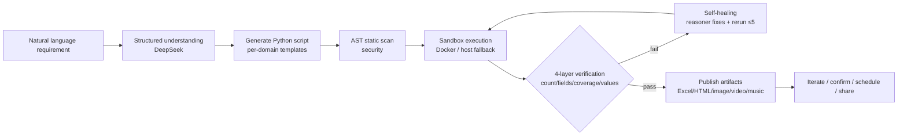
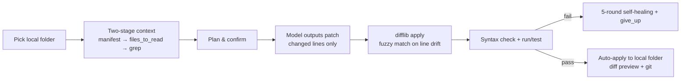

# 🤖 AI Automation Generator

> **Describe it in one sentence → AI writes the code, runs it, verifies it, and ships it.**
>
> An **LLM-as-Compiler engine**: natural language requirements are compiled into executable scripts, run in a sandbox, verified by a 4-layer checker, self-healed on failure, and published as shareable artifacts (games, reports, videos, images, music, TTS, data).

Built with **FastAPI + DeepSeek + Next.js** · Zero-code automation · Docker-ready

[Features](#-features) · [Quick Start](#-quick-start) · [Architecture](#-architecture) · [Security](#-security) · [Docs](#-docs) · [Roadmap](#-roadmap)

---

## ✨ Why this project

This is not a "prompt wrapper" — it's a real engineering effort around **LLM-as-Compiler**. Highlights:

| Highlight | Description |
|---|---|
| 🧠 **LLM-as-Compiler pipeline** | Requirement → structured understanding → Python script generation → sandbox execution → **4-layer verification** (count / fields / feature coverage / values) → self-healing |
| 🩹 **Multi-round self-healing** | On failure, full stderr is fed back to the reasoning model (deepseek-reasoner); it can swap implementations (e.g. native compile failure → pure-JS alternative), up to 5 rounds, with an explicit `give_up` escape |
| 📝 **apply_patch protocol** | The model outputs **only changed lines (diff)** instead of rewriting whole files — dramatically fewer output tokens; backend applies with difflib + fuzzy matching when line numbers drift |
| 📂 **Two-stage context** | For large projects, first show a file manifest and let the model pick what to read (`files_to_read`) + **grep** to locate call sites / definitions (measured: only 1-2 of 17 files read) |
| 🔧 **AI dev assistant** (`/assistant`) | Pick a local folder → AI plans → confirm → edits → auto-applies back, with run/test/background-service support and diff preview |
| 🛡️ **Defense-in-depth security** | AST static scanning (eval/exec, command injection, SSRF, sensitive-file reads, login-state exfiltration) + Docker sandbox + zip-slip/bomb protection + same-origin XSS isolation (see [Security](#-security)) |
| 🧩 **Skill system** | Declarative `SKILL.md` skills (FFmpeg video editing, ezdxf CAD drawing…) auto-matched by keywords, zero-code extension |
| ⏰ **Automation** | Timed reminders, window/screen monitors, recurring tasks — 30s scheduler with dedup and overlap protection |
| 🧠 **Memory system** | AI remembers your preferences/habits (e.g. "I like Excel output") and applies them to future tasks; manage at `/memory` |
| 🤖 **Agent dual-mode** | Simple tasks: single-shot compile (low cost); complex tasks: auto multi-round loop (write→run→finish, up to 8 rounds) |
| 🎬 **Streaming output** | TTS long-text segmentation (no truncation), Range streaming playback for video/audio |
| 🎨 **Content generation suite** | HTML reports, web games, AI music/video/image, TTS, data Q&A |

---

## 🚀 Quick Start

### Requirements
Python 3.10+ · Node.js 18+ · Docker (optional, recommended)

### One-command start (Windows)

```powershell
Copy-Item .env.example .env   # fill in DEEPSEEK_API_KEY (required) and JWT_SECRET_KEY
powershell -ExecutionPolicy Bypass -File start.ps1        # backend 8000 + frontend 3000 + assets 8001
powershell -ExecutionPolicy Bypass -File start.ps1 -tunnel  # add public tunnel for sharing
```

### Manual start

```bash
# Backend
cd backend && pip install -r requirements.txt
uvicorn app.main:app --host 0.0.0.0 --port 8000

# Frontend
cd frontend && npm install && npm run dev

# Assets server (shareable artifacts)
python -m http.server 8001 --directory web
```

Access:
- Web UI **http://localhost:3000** (`/mini` one-shot automation, `/assistant` dev assistant, `/gallery` gallery, `/automations` automation manager, `/sessions` login state, `/files` files, `/memory` AI memory, `/history` history)
- API docs **http://localhost:8000/docs**

### CLI dev assistant (conversational project editing)

```bash
python cli/agent-cli.py                      # interactive session in cwd
python cli/agent-cli.py C:\path\to\project   # target a project
python cli/agent-cli.py --resume             # resume last session
python cli/agent-cli.py --yes                # auto-approve mode
```

---

## 🔑 Environment variables

See [.env.example](.env.example) for the full list. Core:

```env
# DeepSeek (required)
DEEPSEEK_API_KEY=sk-xxx
DEEPSEEK_API_KEYS=sk-a,sk-b          # comma-separated, auto load-balance + retry/backoff
AI_MODEL=deepseek-chat
AI_MODEL_REASONING=deepseek-reasoner # used for repair/complex tasks

# Doubao/Volcano Ark (optional, multimodal)
DOUBAO_API_KEY=ark-xxx

# Sandbox
SANDBOX_IMAGE=python:3.11-slim
SANDBOX_ALLOW_SUBPROCESS=true

# JWT (change me)
JWT_SECRET_KEY=change-me-to-a-random-string
```

---

## 🏗 Architecture

### One-shot automation loop



### Dev-assistant loop (apply_patch)



### Repository layout

```
ai-automation-generator/
├── backend/                        # Backend (FastAPI)
│   ├── app/
│   │   ├── main.py                 # App entry + lifespan (scheduler/worker/reaper/alerts)
│   │   ├── config.py               # Env config (.env)
│   │   ├── database.py             # SQLite/PostgreSQL data layer (parameterized + whitelist + pool)
│   │   ├── paths.py                # Unified path resolution (profiles/artifacts/tmp)
│   │   ├── db_adapter.py           # PostgreSQL adapter (? → %s, skips PRAGMA)
│   │   ├── api/
│   │   │   ├── auth.py             # Register/login/JWT
│   │   │   ├── auth_sessions.py    # Login-state storage (2h TTL, per-account)
│   │   │   ├── mini.py             # Tasks/submit/status/download/stream/automation/stats
│   │   │   ├── local_exec.py       # Local-execution poll/report API
│   │   │   ├── upload.py           # Image/data-file upload
│   │   │   ├── gallery.py          # Share center (artifacts/zip)
│   │   │   └── game.py             # Multiplayer game rooms
│   │   ├── services/
│   │   │   ├── mini_generator.py   # LLM-as-Compiler main loop (generate→verify→heal)
│   │   │   ├── mini_tasks.py       # Task engine + apply_patch + two-stage context + scheduler + reaper
│   │   │   ├── distributed.py      # Redis distributed layer (queue/lock/dedup/ratelimit/semaphore/leader)
│   │   │   ├── local_exec.py       # Local execution mode (cloud script → local exe)
│   │   │   ├── storage.py          # Artifact storage abstraction (local/shared volume/S3)
│   │   │   ├── llm_client.py       # Multi-key rotation + retry + backoff + multi-provider
│   │   │   ├── long_task.py        # Background task registry (lock + cancel)
│   │   │   ├── vision/video/tts_client.py   # Multimodal clients
│   │   │   ├── page_capture.py     # Playwright DOM structure capture
│   │   │   └── site_analyzer.py    # Website structure analysis
│   │   ├── sandbox/
│   │   │   ├── docker_executor.py  # Docker sandbox (mem/CPU limits, read-only mounts) + host fallback
│   │   │   ├── security.py         # AST static scan (defense in depth)
│   │   │   ├── static_check.py     # Pre-execution checks (infinite loops etc.)
│   │   │   └── auto_fix.py         # Known Playwright misuse auto-fix
│   │   └── skills/                 # SKILL.md skill system (FFmpeg/CAD)
│   ├── tests/                      # 140 pytest cases
│   ├── requirements.txt
│   ├── Dockerfile                  # Backend image
│   └── Dockerfile.sandbox          # Prebuilt sandbox image (instant worker startup)
│
├── frontend/                       # Frontend (Next.js 14)
│   └── src/
│       ├── app/                    # Pages: mini / assistant / gallery / automations
│       │                           #        history / files / memory / sessions / monitor
│       ├── components/             # AppNav + UI components + PreviewTable
│       └── lib/                    # api.ts (API client) + types + utils
│
├── cli/                            # Command-line tools (local side)
│   ├── agent-cli.py                # CLI dev assistant (conversational project editing)
│   ├── local_worker.py             # Local execution end (hybrid mode, self-contained AST scan)
│   └── build_local_worker.ps1      # PyInstaller packaging → local_worker.exe
│
├── deploy/                         # Cloud deployment configs
│   ├── nginx-https.conf            # Nginx reverse proxy + TLS hardening + static cache
│   ├── init-certbot.sh             # Let's Encrypt issuance + auto-renewal
│   └── README.md                   # Deployment steps
│
├── docs/                           # Docs: ARCHITECTURE / SECURITY / API / DEPLOYMENT
├── docker-compose.yml              # One-command orchestration (redis/postgres/backend/frontend/assets)
├── start.ps1                       # Local one-click start (backend 8000 + frontend 3000 + assets 8001)
├── setup-git-hooks.ps1/.sh         # git pre-commit hooks (auto-test on commit)
├── .env.example                    # Env template
└── README.md / README.en.md        # Project docs
```

---

## 🛡 Security

Deep security investment (great interview material):

1. **Same-origin XSS isolation**: AI-generated artifact pages are served from a **different origin** than the API; download endpoints force `octet-stream + nosniff + attachment` for html/svg/xml
2. **AST static scan** (`sandbox/security.py`): `eval/exec/compile`, `os.system/popen`, `__builtins__` smuggling, `getattr`/`__dict__` bypasses, SSRF (incl. post-DNS IP check), sensitive-file reads (`.env`/`.db`/keys), login-state `_AUTH` exfiltration, destructive ops outside workspace — all blocked **before execution**
3. **Docker sandbox**: no privileged, read-only script mounts, mem/CPU limits, bridge network, timeout + inactivity detection + process-tree cleanup
4. **Command safety**: dangerous-command blacklist + Windows cmd `&` separator blocking + timeout
5. **Zip protection**: zip-slip traversal + zip bomb (counted by actual bytes written)
6. **Auth**: JWT (algorithm whitelist) + IP-bound anonymous identity + trusted-proxy XFF (last value) + rate limiting
7. **Data layer**: fully parameterized SQL + dynamic-field whitelist + atomic credit deduction + per-user ownership checks
8. **Artifact exfiltration**: `[OUTPUT_FILE]` protocol only accepts paths inside the sandbox output dir

See [docs/SECURITY.md](docs/SECURITY.md) for the full threat model.

---

## ☁️ Cloud Architecture & Hybrid Mode

### Distributed task system (Redis, optional)

Configure `REDIS_URL` to enable the cloud multi-instance mode (leave empty for
single-node, fully backward compatible):

- **Redis task queue** (LPUSH/BRPOP) with worker lease + heartbeat → multi-worker
  auto load balancing, no duplicate execution
- **Crash auto-recovery** (reaper): lost tasks (lease expired + not in queue) are
  re-queued automatically, dead-letter after retry limit
- **Sandbox for the cloud**: shared dirs (`SANDBOX_PROFILE_ROOT`/`ASSET_WEB_ROOT`)
  + global concurrency (Redis semaphore) + orphan container cleanup
- **Global rate limiting** (Redis counter), **queue priority** (high/normal),
  **result cache** (reuse identical requests, save LLM cost), **leader election**
- **Observability**: `/monitor` page (success rate / worker health / queue depth)
  + alert notifications (worker down / queue backlog / failure spike)
- **PostgreSQL** (`DATABASE_URL`, optional, connection pool) + **object storage**
  (`STORAGE_BACKEND=s3`) + **CI/CD** (GitHub Actions) + **HTTPS** (nginx/certbot)

### Hybrid mode (local execution)

The cloud sandbox runs on servers and cannot write to a user's local disk.
Tasks like *"create report.txt in D:/My Documents"* are **auto-detected**
(keywords: 本地/创建文件/paths) and dispatched to the user's local
`local_worker.exe`, which executes them on the user's machine and reports back:

```
User submits a local-file task
   │  auto-detected (no toggle needed)
   ▼
Redis local queue aiagent:queue:local:{user_id} (per-user isolation)
   │  local exe polls POST /api/local/tasks/poll
   ▼
Cloud lazily generates a stdlib-only script → returns to exe
   ▼
exe runs it locally (built-in AST scan + subprocess isolation) → file created on disk
   ▼
POST /api/local/tasks/report → cloud marks done
```

**User experience**: download exe → double-click → log in once (email + password)
→ fully automatic. Cloud URL is baked in at build time; token is saved locally.

```powershell
$env:LOCAL_WORKER_SERVER="https://your-domain.com"
powershell -ExecutionPolicy Bypass -File cli/build_local_worker.ps1   # → cli/dist/local_worker.exe
```

---

## 📚 Docs

- [Architecture deep-dive](docs/ARCHITECTURE.md) — LLM-as-Compiler, apply_patch, two-stage context, self-healing, sandbox, scheduler, ADR
- [Security](docs/SECURITY.md) — threat model & mitigation matrix
- [API overview](docs/API.md) — endpoint list, task state machine, automation intent parsing
- [Cloud deployment](docs/DEPLOYMENT.md) — multi-instance scaling (Redis queue, hybrid local-execution mode, HTTPS, CI/CD)
- [CLI usage](cli/agent-cli.py) — dev assistant command-line tool

---

## 🧪 Test results (real)

- 100 general tasks: **98%+** pass rate (Excel/Word/PPT/files/data/text/API/image/PDF)
- Complex multi-dimensional tasks (3-6 dimensions): **9/9** pass, data verified against official APIs
- Login-state scraping 3/3; multimodal (vision/video/img2video) tested
- 4-layer verification catches false passes (missing count/fields/features/wrong values → auto-fix)
- apply_patch: existing-file changes output only a few diff lines (measured: search feature +4/+9 lines, no duplication)
- Two-stage context: 17-file project reads only 1-2 relevant files (grep locates hidden call sites)

---

## 🗺 Roadmap

- [x] LLM-as-Compiler loop + 4-layer verification + self-healing
- [x] Multimodal (vision/video/image/TTS)
- [x] Skill system (FFmpeg / CAD)
- [x] AI dev assistant + apply_patch + two-stage context + grep
- [x] Automation (reminders / monitors / recurring)
- [x] Multi-model backends (DeepSeek/OpenAI/Anthropic/Ollama switchable)
- [x] Agent dual-mode (single-shot compile + multi-round autonomous loop)
- [x] Test suite (140+ pytest cases + auto-test on commit)
- [x] Streaming video/audio output (TTS long-text segmentation + Range streaming endpoint)
- [x] Browser automation reliability (lazy-load/infinite-scroll + captcha detection/wait)
- [x] **Cloud**: Redis distributed queue + crash auto-recovery + sandbox shared dirs / global concurrency / orphan cleanup
- [x] **Cloud**: global rate limit / queue priority / result cache / leader election / alerts / monitor page
- [x] **Cloud**: PostgreSQL adapter (connection pool) + object storage (S3/MinIO) + full task logs
- [x] **Cloud**: CI/CD (GitHub Actions) + HTTPS (nginx/certbot) + prebuilt sandbox image
- [x] **Hybrid**: local execution mode (local-file tasks dispatched to user's local exe)
- [ ] Multimodal input (audio/video understanding)

---

## 🤝 Contributing

Contributions welcome — features, docs, tests, security audits. See [CONTRIBUTING.md](CONTRIBUTING.md) and [CODE_OF_CONDUCT.md](CODE_OF_CONDUCT.md).

## 📄 License

[MIT](LICENSE) © AI Automation Generator Contributors
