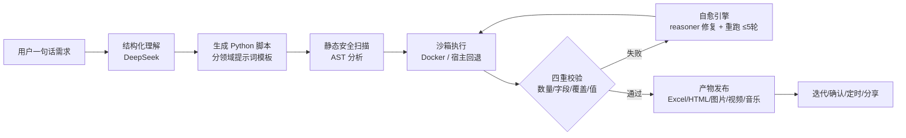
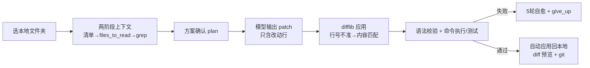

<div align="center">

# 🤖 AI Automation Generator · AI 通用自动化 Agent

**Describe it in one sentence → AI writes the code, runs it, verifies it, and ships it.**
一句话描述需求 → AI 自动写代码、沙箱执行、四重校验、自愈修复、产出可分享结果。

Built with **FastAPI + DeepSeek + Next.js** · 开箱即用 · 支持 Docker

[](LICENSE)
[](backend/app)
[](backend/app/main.py)
[](frontend)
[](.env.example)
[](docker-compose.yml)

[功能](#-核心能力) · [快速开始](#-快速开始) · [架构](#-架构) · [安全设计](#-安全设计) · [文档](#-文档) · [路线图](#-roadmap)

English: [README.en.md](README.en.md)

</div>

---

## ✨ 项目亮点（Why this project）

这个项目不是简单的"提示词包装"，而是一个 **LLM-as-Compiler 引擎**：把自然语言需求当作"源代码"，编译成可执行产物，并在编译-运行-校验-修复的闭环中不断逼近正确结果。核心工程亮点：

| 亮点 | 说明 |
|---|---|
| 🧠 **LLM-as-Compiler 管线** | 需求 → 结构化理解 → 生成 Python 脚本 → 沙箱执行 → **四重校验**（数量/字段/功能覆盖/数据值）→ 自愈重跑 |
| 🩹 **多轮自愈引擎** | 运行失败时把完整错误反馈给推理模型（deepseek-reasoner），自动换实现方案（如原生编译失败改纯 JS 替代），最多 5 轮，可中途 `give_up` 明确放弃 |
| 📝 **apply_patch 协议** | 模型只输出**改动行（diff）**而非整个文件，输出 token 大幅下降；后端 difflib 应用 + 行号不准时内容模糊匹配兜底 |
| 📂 **两阶段上下文** | 大项目先给文件清单让模型点菜（`files_to_read`），只读需要的文件；支持 **grep 搜索**定位调用点/定义点（实测 17 文件项目只读 1-2 个文件） |
| 🔧 **AI 开发助手**（`/assistant`） | 选本地文件夹 → AI 规划→确认→改码→自动应用回本地，支持运行/测试/启动长驻服务，改动自动 diff 预览 |
| 🛡️ **纵深安全设计** | AST 静态扫描（拦 eval/exec/命令注入/SSRF/敏感文件读取/登录态外泄）+ Docker 沙箱 + zip-slip/zip 炸弹防护 + 同源 XSS 隔离（详见 [安全设计](#-安全设计)） |
| 🧩 **技能系统** | `SKILL.md` 声明式技能（FFmpeg 视频剪辑、ezdxf CAD 绘图…），关键词自动匹配，零代码扩展 |
| ⏰ **自动化** | 定时提醒、窗口/屏幕监控、循环任务，30s 调度器 + 去重 + 防重叠 |
| 🧠 **记忆系统** | AI 自动记住你的偏好/习惯（如"喜欢 Excel 输出"），后续任务自动按此执行；`/memory` 可查看/管理 |
| 🤖 **Agent 双模式** | 普通任务走单轮编译（省成本）；复杂任务自动切换多轮自主循环（write→run→finish，可 `give_up`），最多 8 轮 |
| 🎬 **流式输出** | TTS 长文本分段合成（不截断）、产物 Range 流式播放（视频/音频边下边播） |
| 🎨 **内容生成全家桶** | HTML 报告、网页游戏、AI 音乐/视频/图片、TTS 配音、数据问答 |

---

## 🚀 快速开始

### 环境要求
- Python 3.10+ · Node.js 18+ · （可选）Docker

### 一键启动（Windows）

```powershell
# 1. 配置密钥
Copy-Item .env.example .env
# 编辑 .env，填入 DEEPSEEK_API_KEY（必填），JWT_SECRET_KEY

# 2. 一键启动（后端 8000 + 前端 3000 + 分享服务 8001）
powershell -ExecutionPolicy Bypass -File start.ps1

# 加公网隧道（可分享链接）
powershell -ExecutionPolicy Bypass -File start.ps1 -tunnel
```

### 手动启动

```bash
# 后端
cd backend && pip install -r requirements.txt
uvicorn app.main:app --host 0.0.0.0 --port 8000

# 前端
cd frontend && npm install && npm run dev

# 分享服务（web 作品静态托管）
python -m http.server 8001 --directory web
```

访问：
- 前端 **http://localhost:3000**（一句话自动化 `/mini`、开发助手 `/assistant`、分享中心 `/gallery`、自动化管理 `/automations`、登录态管理 `/sessions`、我的文件 `/files`、AI 记忆 `/memory`、任务历史 `/history`）
- 后端 API 文档 **http://localhost:8000/docs**

### CLI 开发助手（持续对话改你的项目）

```bash
python agent-cli.py                      # 当前目录进入交互会话
python agent-cli.py C:\path\to\project   # 指定项目
python agent-cli.py --resume             # 恢复上次会话
python agent-cli.py --yes                # 自动确认模式
```

---

## 🔑 环境变量（.env）

完整配置见 [.env.example](.env.example)，核心项：

```env
# DeepSeek（文本大脑，必填）
DEEPSEEK_API_KEY=sk-xxx
DEEPSEEK_API_KEYS=sk-a,sk-b          # 多 key 逗号分隔（自动负载均衡+限流退避）
AI_MODEL=deepseek-chat               # 日常生成
AI_MODEL_REASONING=deepseek-reasoner # 修复/复杂任务

# 豆包/火山方舟（可选，多模态：视觉/视频/图片/TTS）
DOUBAO_API_KEY=ark-xxx

# 沙箱
SANDBOX_IMAGE=python:3.11-slim       # Docker 沙箱镜像（无 Docker 自动回退宿主+静态扫描）
SANDBOX_ALLOW_SUBPROCESS=true

# JWT（必改）
JWT_SECRET_KEY=change-me-to-a-random-string
```

---

## 🏗 架构

### 一句话自动化闭环



### 开发助手闭环（apply_patch）



### 服务结构

| 服务 | 端口 | 职责 |
|---|---|---|
| FastAPI 后端 | 8000 | 任务引擎、沙箱、API、调度器 |
| Next.js 前端 | 3000 | Web 工作台 |
| 静态产物服务 | 8001 | 分享作品（与 API **不同源**，防同源 XSS） |

### 核心模块

```
backend/app/
├── api/              auth, upload, mini(任务/自动化), gallery, game, auth_sessions(登录态)
├── services/
│   ├── mini_generator.py   LLM-as-Compiler 主闭环（生成→校验→自愈）
│   ├── mini_tasks.py       任务队列 + apply_patch + 两阶段上下文 + 调度器（30s）
│   ├── llm_client.py       多 key 轮询 + 重试 + 限流退避
│   ├── vision/video/tts_client.py   多模态客户端
│   └── page_capture.py     Playwright DOM 结构采集（反爬优先控件）
├── sandbox/
│   ├── docker_executor.py  Docker 沙箱（内存/CPU 限制、只读挂载）+ 宿主回退
│   └── security.py         AST 静态安全扫描（纵深防御）
├── skills/            SKILL.md 技能系统
└── database.py        SQLite（参数化查询 + 字段白名单）
```

---

## 🛡 安全设计

这个项目在安全上做了**深度投入**（可作为面试讲点），包括：

1. **同源 XSS 隔离**：产物页（LLM 生成的 HTML）与 API **不同源**部署，API 不挂载 web/ 静态目录；下载端点对 html/svg/xml 强制 `octet-stream + nosniff + attachment`
2. **AST 静态扫描**（`sandbox/security.py`）：`eval/exec/compile`、`os.system/popen`、`__builtins__` 走私、`getattr`/`__dict__` 绕过、SSRF 内网地址（含 DNS 解析后判定）、敏感文件读取（.env/.db/密钥）、登录态 `_AUTH` 外泄、越权删除——全部在**执行前**拦截
3. **Docker 沙箱**：无 privileged、脚本目录只读挂载、内存/CPU 限额、bridge 网络、超时+卡死检测+进程树清理
4. **命令安全**：危险命令黑名单 + Windows cmd 分隔符（`&`）拦截 + 超时限制
5. **zip 防护**：zip-slip 路径穿越 + zip 炸弹（按实际写出字节计数）
6. **认证**：JWT（算法白名单）+ 匿名身份绑定 IP + XFF 可信代理校验（取末值）+ 匿名限速
7. **数据层**：SQL 全参数化 + 动态字段白名单 + 积分原子扣减 + 任务归属校验
8. **产物外泄防护**：`[OUTPUT_FILE]` 协议只接受沙箱输出目录内的路径

详见 [docs/SECURITY.md](docs/SECURITY.md)。

---

## 📚 文档

- [架构详解](docs/ARCHITECTURE.md) — 核心机制深度拆解（LLM-as-Compiler、apply_patch、两阶段上下文、自愈引擎）
- [安全设计](docs/SECURITY.md) — 威胁模型与防护措施
- [API 概览](docs/API.md) — 端点清单
- [CLI 使用](agent-cli.py) — 开发助手命令行工具

---

## 🧪 验证成绩（真实测试）

- 100 个通用任务连测 **98%+** 通过（Excel/Word/PPT/文件/数据/文本/API/图片/PDF）
- 复合长难任务（3-6 维度组合）**9/9** 通过，数据与官方 API 逐项核对一致
- 登录态抓取 3/3、多模态（图片识别/视频/图生视频）实测通过
- 四重校验拦截假通过：数量不足 / 漏字段 / 漏功能 / 值异常自动修复
- apply_patch：已有文件改动只输出几行 diff（实测搜索功能 +4 行/+9 行，无重复）
- 两阶段上下文：17 文件项目只读取 1-2 个相关文件（grep 精确定位隐藏调用点）

---

## 🗺 Roadmap

- [x] LLM-as-Compiler 闭环 + 四重校验 + 自愈
- [x] 多模态（视觉/视频/图片/TTS）
- [x] 技能系统（FFmpeg / CAD）
- [x] AI 开发助手 + apply_patch + 两阶段上下文 + grep
- [x] 自动化（提醒/监控/循环）
- [x] 多模型后端（DeepSeek/OpenAI/Anthropic/Ollama 可切换）
- [x] Agent 双模式（普通单轮编译 + 复杂任务多轮自主循环）
- [x] 测试套件（50+ 用例 + git 提交自动测试）
- [x] 视频/音频流式输出（TTS 长文分段合成 + Range 流式播放端点）
- [x] 浏览器自动化可靠性增强（懒加载/无限滚动 + 验证码检测等待）
- [ ] 多模态输入（音频/视频理解）

---

## 🤝 贡献

欢迎任何形式的贡献：功能、文档、测试、安全审计。请先阅读 [CONTRIBUTING.md](CONTRIBUTING.md)。

## 📄 License

[MIT](LICENSE) © AI Automation Generator Contributors
